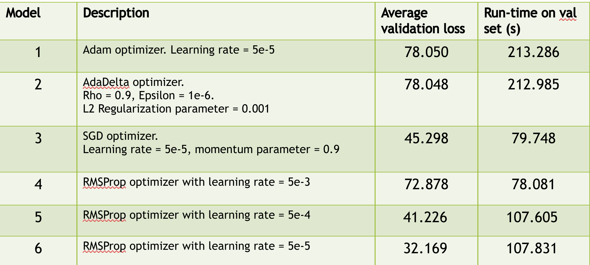
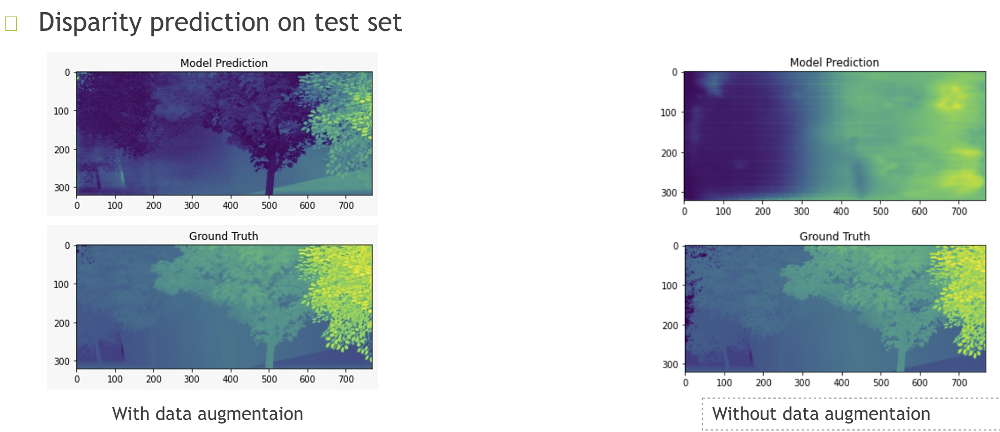

# Stereo_Matching_NN

# Sparse Cost Volume Neural Network (SCV-Net)[1] for Stereo Matching

---

  

  Pascal Dao  
  Bindi Nagda  
  pdao2015@my.fit.edu  
  bnagda2015@my.fit.edu  

Spring 2021

  

  When a scene is captured by two cameras at different vantage points, it is possible to extract 3Dinformation by comparing their images. This is done by estimating the disparity at the same pixellocations between the two images. This is known as stereo matching.Using this technique, it is possible to reconstruct a 3D scene or object from 2 cameras.  Stereomatching has applications in robotics, AR/VR, manufacturing and more.In recent years, learning based stereo matching approaches have been shown to have much greaterperformance than Physics based approaches. This was demonstrated in 2015 by Zbontar et al. Theytrained a Siamese network to find correspondences between two images [3]. The best approach toend-to-end learning based stereo matching is GC-Net [4].  GC-Net treats stereo matching as aregression problem and has sub-pixel accuracy. However GC-Net’s size makes it slow to run. Thisis because the algorithm searches a large cost volume space.  This project implements a SparseCost Volume. This is done simply by increasing the stride of feature maps over the input images.This eliminates redundancy in the cost volume and creates smaller cost volumes. This Sparse CostVolume Network (SCV-Net) was first proposed in [1].
 -----
 
  -----
  

 # References 
  

  
[1] Lu, C.; Uchiyama, H.; Thomas, D.; Shimada, A.; Taniguchi, R.-i.Sparse Cost Volume forEfficient Stereo Matching.Remote Sens.2018, 10, 1844.

[2] N. Mayer and E. Ilg and P. Häusser and P. Fischer and D. Cremers and A. Dosovitskiy and T.Brox, A Large Dataset to Train Convolutional Networks for Disparity, Optical Flow, and SceneFlow Estimation, IEEE International Conference on Computer Vision and Pattern Recognition(CVPR),2016, arXiv:1512.02134,.

[3] Zbontar, J.; LeCun, Y. Computing the stereo matching cost with a convolutional neural network.In Proceedings of the IEEE Conference on Computer Vision and Pattern Recognition, Boston,MA, USA, 7–12 June 2015; pp. 1592–1599.

[4] Kendall, A.; Martirosyan, H.; Dasgupta, S.; Henry, P.; Kennedy, R.; Bachrach, A.; Bry, A.End-to-end learning of geometry and context for deep stereo regression. arXiv2017, arXiv:1703.04309.

---

# Results

